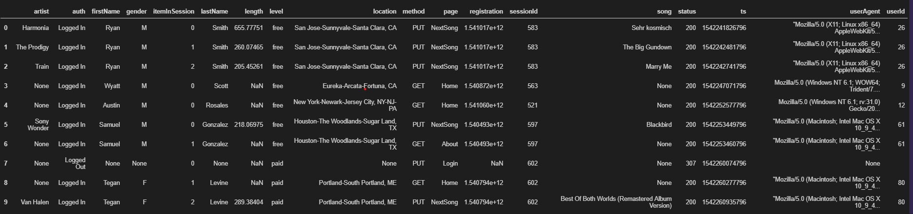

# Data Lake

A python program that builts an etl pipeline that extracts data from S3, processes them using spark, and loads the data back into S3 as a set of dimensional tables. \
The client aims to move their data warehouse to a data lake to allow the analytics team to continue finding insights in what songs their users are listening to.

## Required libraries

1. pyspark [http://spark.apache.org/]
2. configparser [https://github.com/jaraco/configparser/]

### Installation

1. 'pip install pyspark' to implement Python Apache Spark

## Files

- dl.cfg: Contains configurations to connect to Amazon S3 bucket
- etl.py: Python programs that performs etl processes on data from S3 bucket

## Running the tests

1. Enter AWS credentials into dl.cfg
2. Run etl.py

# Data

The growing user base and song database of a music streaming startup, Sparkify. Their data resides in S3, in a directory of JSON logs on user activity on the app, as well as a directory with JSON metadata on the songs in their app.

- song_data (s3a://udacity-dend/song_data): Contains information of invdividual songs
- log_data (s3a://udacity-dend/log_data): Contains logs of user activity on Sparkify application

# Database Overview

## Staging Tables Schema

### song_data                         count: 71

root \
 |-- num_songs: integer (nullable = true) \
 |-- artist_id: string (nullable = true) \
 |-- artist_latitude: double (nullable = true) \
 |-- artist_longitude: double (nullable = true) \
 |-- artist_location: string (nullable = true) \
 |-- artist_name: string (nullable = true) \
 |-- song_id: string (nullable = true) \
 |-- title: string (nullable = true) \
 |-- duration: double (nullable = true) \
 |-- year: integer (nullable = true)

#### Sample:

### log_data                        count:8056

root \
 |-- artist: string (nullable = true) \
 |-- auth: string (nullable = true) \
 |-- firstname: string (nullable = true) \
 |-- gender: string (nullable = true) \
 |-- iteminsession: integer (nullable = true) \
 |-- lastname: string (nullable = true) \
 |-- length: double (nullable = true) \
 |-- level: string (nullable = true) \
 |-- location: string (nullable = true) \
 |-- method: string (nullable = true) \
 |-- page: string (nullable = true) \
 |-- registration: long (nullable = true) \
 |-- sessionid: integer (nullable = true) \
 |-- song: string (nullable = true) \
 |-- status: integer (nullable = true) \
 |-- ts: long (nullable = true) \
 |-- useragent: string (nullable = true) \
 |-- userid: integer (nullable = true)

#### Sample:

## Tables

### songs_table

root \
 |-- song_id: string (nullable = true) \
 |-- title: string (nullable = true) \
 |-- artist_id: string (nullable = true) \
 |-- year: integer (nullable = true) \
 |-- duration: double (nullable = true)

#### Sample:

### artists_table

root \
 |-- artist_id: string (nullable = true) \
 |-- artist_name: string (nullable = true) \
 |-- artist_location: string (nullable = true) \
 |-- artist_latitude: double (nullable = true) \
 |-- artist_longitude: double (nullable = true)

#### Sample:

### users_table

root \
 |-- userid: string (nullable = true) \
 |-- firstname: string (nullable = true) \
 |-- lastname: string (nullable = true) \
 |-- gender: string (nullable = true) \
 |-- level: string (nullable = true)

#### Sample:

### time_table

root \
 |-- timestamp: string (nullable = true) \
 |-- hour: integer (nullable = true) \
 |-- day: integer (nullable = true) \
 |-- week: integer (nullable = true) \
 |-- month: integer (nullable = true) \
 |-- year: integer (nullable = true) \
 |-- weekday: string (nullable = true)

#### Sample:

### songplays_table

root \
 |-- ts: long (nullable = true) \
 |-- userid: string (nullable = true) \
 |-- level: string (nullable = true) \
 |-- song_id: string (nullable = true) \
 |-- artist_id: string (nullable = true) \
 |-- sessionid: integer (nullable = true) \
 |-- location: string (nullable = true) \
 |-- useragent: string (nullable = true)
 
#### Sample:

# Project Overview

## Built with

[Amazon S3](https://aws.amazon.com/S3/) - Data used
[Python](https://www.python.org/) - Programming language

## Authors

**Jobelle Lee** - [themaxermister](https://github.com/themaxermister/data-warehouse)
